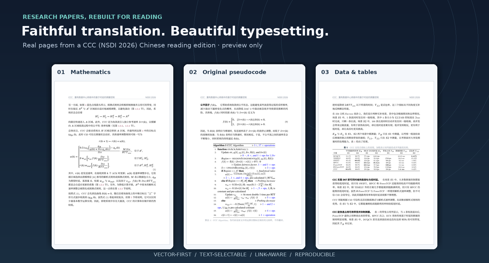
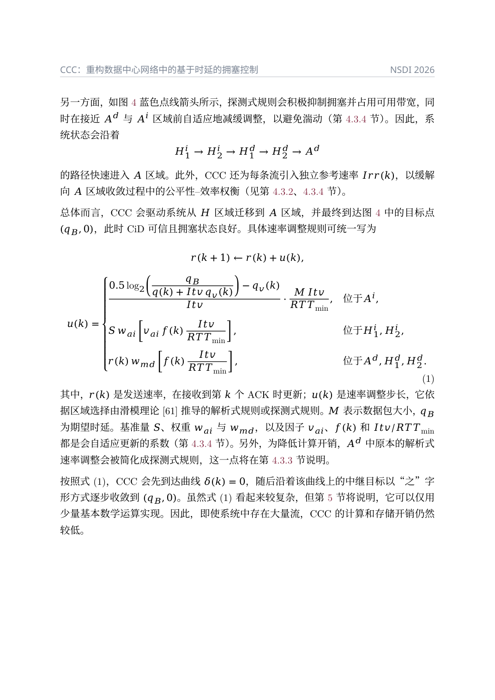
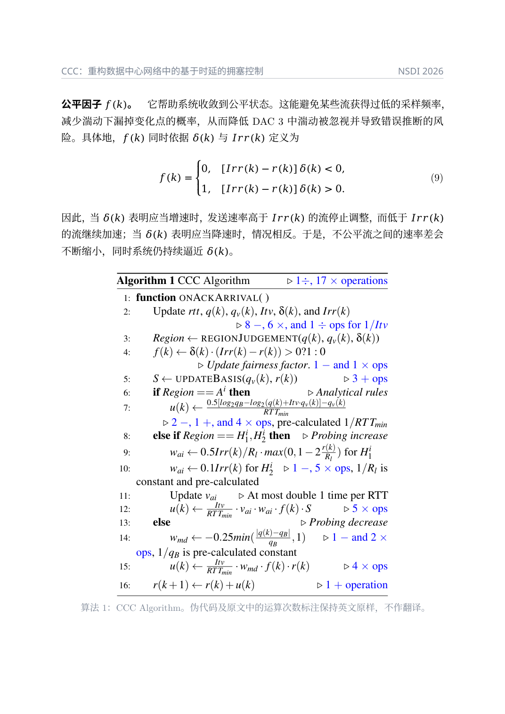
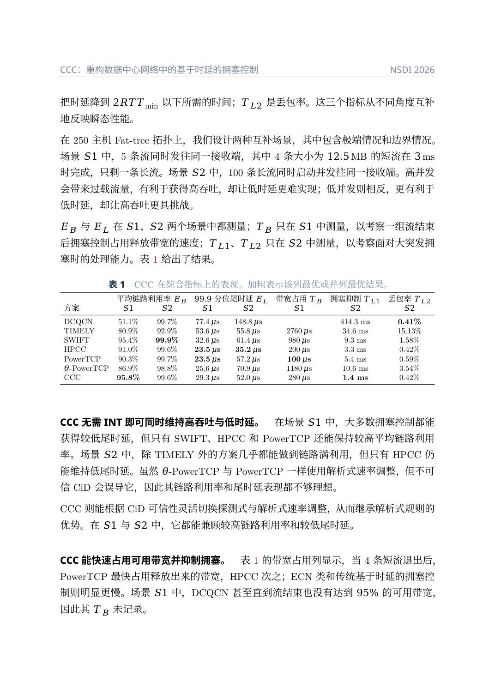
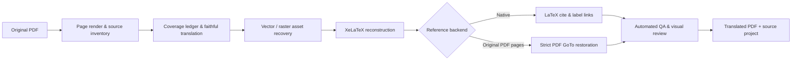

<div align="center">

# 📖 paper-translation

### Papers deserve more than a wall of machine-translated text.

**An agent skill for faithful academic-paper translation, vector-first figure preservation, and elegant LaTeX reading editions.**

[](LICENSE)


**English** · [简体中文](README.md) · [Skill Instructions](SKILL.md) · [Contributing](CONTRIBUTING.md)



<sub>Real typeset pages from a CCC (NSDI 2026) translation · Preview excerpts only; [source attribution and permissions](THIRD_PARTY_NOTICES.md)</sub>

</div>

---

## The idea

A paper is **not just text**. Its meaning lives in formulas, figure axes, exact measurements, carefully hedged claims, algorithm steps, and citations that lead somewhere.

`paper-translation` tells an AI coding agent how to turn an academic PDF into a **complete Chinese reading edition** without throwing those parts away. It combines a high-fidelity translation protocol with working PDF scripts, a standalone XeLaTeX template, semantic cross-references, and multiple quality gates.

> **This is an agent workflow, not a one-command translation API.** The scripts extract, build and validate; the connected AI agent reads and translates the paper, verifies meaning, and fixes layout. The skill includes no LLM API keys, login mechanism, or proprietary model dependency.

## What makes it different?

| | What the skill actually does |
|:--|:--|
| 🧭 **No silent omissions** | Proposes source-to-target coverage maps from chapter headings and vector-crop geometry; requires real source-to-translation review before sign-off. |
| ⚡ **Less wasted context** | Creates compact source packets per section, keeps full TeX logs on disk, and preserves source-ID accounting and strict final QA. |
| 🧪 **Scientific meaning first** | Preserves hedging, causal relations, units, percentiles, equations, experimental data and every paper section. |
| ✒️ **Real typesetting** | Searchable Chinese prose and native LaTeX equations instead of page screenshots pasted into a PDF. |
| 🧬 **Vector-first figures** | Extracts original raster objects or crops original **PDF vectors** with axes, labels and annotations intact. |
| 🧩 **Original pseudocode** | Keeps Algorithm blocks in English by default to avoid changing operational meaning. |
| 🔗 **Working references** | Supports native `\cite` + `\bibitem` **or** original bibliography PDF pages with verified GoTo links. |
| 🪄 **An actual aesthetic** | A standalone, quiet academic template with Latin Modern Roman, restrained color, legible CJK and generous spacing. |
| ✅ **Checks that fail** | Recursive multi-file TeX checks, coverage matching, missing-reference detection, compilation-log audit, PDF-link inspection, page rendering. |

### Actual output — three representative pages

<details>
<summary><b>Expand the full-size screenshots</b> · formulas · preserved algorithm · evaluation table</summary>

| Mathematics | Algorithm 1 | Experimental data |
|:--:|:--:|:--:|
|  |  |  |

*These are screenshots for documentation only. Actual paper figures in the resulting PDF are preserved as native vector PDF assets where possible.*

</details>

## How it works



1. **Inspect** every source page, column, section, figure, equation, footnote, and bibliography entry.
2. **Translate** with a terminology glossary and a per-block coverage ledger, checking scientific claims against the source.
3. **Recover** photos as original embedded bitmaps and scientific plots as native PDF vector crops (not lossy screenshots).
4. **Typeset** each section with LaTeX math, figures, captions, tables, internal labels, and untouched pseudocode.
5. **Link** citations using the bibliography backend most faithful to the available source.
6. **Validate** with executable checks and a final render → inspect → fix loop.

The full agent playbook lives in [`SKILL.md`](SKILL.md), with detailed guides in [`references/`](references/).

## ⚡ Token-aware, not completeness-compromised

A full scholarly translation has a necessary output-token cost. The savings come from avoiding repeated full-PDF uploads, giant coverage tables, unnecessarily loaded guides, and verbose TeX build transcripts—not from omitting the appendix or scientific qualifiers.

```bash
# After setting paper-specific headings in assets/coverage-map.json
make seed-coverage         # build unreviewed suggestions for every source block
make packets               # work/context-packets/index.md + section-specific .md
# Agent reads ONE section packet plus the relevant original rendered pages
make                       # concise summary; complete build log saved on disk
make release               # full strict coverage, links, rendering verification
```

Resume with `scripts/prepare_section_packets.py --pending-only --target sections/01-introduction.tex` when a part has already been verified. The script never marks coverage completed. Source-rendered equations, tables, charts, and column transitions remain authoritative. See [the token-efficiency guide](references/TOKEN_EFFICIENCY.md). Any prefix-cache benefit depends on the actual model/API harness and must be measured rather than assumed.

## Quick start

### 1. Requirements

- Python **3.10+**, [`PyMuPDF`](https://pymupdf.readthedocs.io/) and [`Pillow`](https://pillow.readthedocs.io/)
- **XeLaTeX** and `latexmk`, with a sufficiently complete TeX Live distribution (`xeCJK`, `unicode-math`, `scrartcl`, `siunitx`, `pdfpages`, etc.)
- A CJK serif/sans font, ideally **Noto Serif CJK / Noto Sans CJK** or Source Han fonts. No fonts are bundled.
- An AI agent that can read PDFs, edit files and run commands to carry out the translation itself.

### 2. Clone and initialize

```bash
git clone https://github.com/Micraow/paper-translation-skill.git
cd paper-translation-skill
python3 -m pip install -r requirements.txt

python3 scripts/init_project.py ../my-paper
cp /path/to/original-paper.pdf ../my-paper/sources/original.pdf
cd ../my-paper
```

Point your AI agent at the skill's `SKILL.md` and give it the paper PDF. A suitable request:

> Translate this paper completely into Chinese using the paper-translation skill. Preserve every formula, vector figure and data table; leave pseudocode in English; keep all sections and appendices; make citations and cross-references clickable. Return both the PDF and reproducible LaTeX source. Finish the coverage ledger and visual QA.

### 3. Preview the template, then translate

```bash
make                     # builds the generic demo with native citation links
make render              # creates work/final-render/contact-sheet.png
```

### Coverage maps for long two-column papers

```bash
cp assets/coverage-map.example.json assets/coverage-map.json
# First read the rendered original; edit ALL heading patterns, paths, and column_split_x.
make seed-coverage          # suggestions only: every status remains todo
# After reviewing the full source section against its translation:
python scripts/confirm_coverage.py work/coverage.tsv --status translated \
  --target sections/01-introduction.tex \
  --review-note 'Compared all source blocks and column boundaries on pages 2-3'
```

Every expected source heading must be matched *exactly once* or the seeder fails, avoiding silently misassigned sections. See [the practical coverage ledger guide](references/COVERAGE_LEDGER.md). The template now includes safe `\us` units, Chinese `\zhstrong`, Latin small caps and a separate algorithm float with working references. Glyph substitution and CJK italic fallback block the default QA gate.

**Important:** The initial template contains clearly marked **dummy text and one dummy bibliography item**. Compiling it only tests your environment; it does **not** translate the original paper. The agent replaces all sample content, then rebuilds and reviews.

## Two bibliography strategies

This is an explicit choice; the strategies should not be mixed.

<details open>
<summary><b>Option A · Native LaTeX bibliography (recommended)</b></summary>

Write the paper's original bibliography in `sections/references.tex`, preserving source order and metadata; cite via `\cite{key}`. Use `\label`/`\ref`/`\eqref` for internal references.

```bash
make                         # BIB_MODE=native is default
```

LaTeX produces clickable citations and the recursive checker verifies keys and labels across all `\input` files.

</details>

<details>
<summary><b>Option B · Original vector bibliography pages</b></summary>

Set `\OriginalReferencePages` to the original PDF's reference page range, keep numeric citation markers in the translated text, and use:

```bash
make BIB_MODE=pdf
# Only if bibliography auto-detection is ambiguous:
make BIB_MODE=pdf REF_START_PAGE=35 REF_END_PAGE=38
```

The original reference pages remain PDF vectors. The postprocessor restores in-document GoTo links **and fails** if numbered targets or visible citation links are missing. Page numbers passed through `REF_START_PAGE` refer to the **compiled translated PDF**, not source PDF.

</details>

## A release isn't just a successful `xelatex`

```bash
make                     # build + cite/label + TeX log + PDF-link QA
make release             # also checks complete coverage vs extracted source blocks
```

Before `make release`, run `make seed-coverage` to draft chapter/asset suggestions, then **visually review** each section and confirm the exact source-to-target mappings. The release target fails for missing blocks, unfinished `todo` entries, nonexistent translation targets, missing links, or compile errors.

**Automation cannot certify semantic accuracy.** Open the contact sheet and inspect every figure/algorithm/table page, equations, all footnotes, the bibliography and appendix, and compare the Chinese text against the original PDF—especially two-column boundaries.

<details>
<summary><b>Repository structure</b></summary>

```text
paper-translation-skill/
├── SKILL.md                  # Agent-facing instruction manual
├── README.md                 # Chinese landing page
├── README.en-US.md           # English documentation
├── LICENSE                   # MIT license (own source only)
├── THIRD_PARTY_NOTICES.md    # Paper, previews, fonts, dependency rights
├── agents/openai.yaml        # Agent skill metadata
├── requirements.txt
├── scripts/
│   ├── init_project.py
│   ├── inspect_pdf_assets.py
│   ├── extract_text_blocks.py
│   ├── seed_coverage.py
│   ├── confirm_coverage.py
│   ├── validate_coverage.py
│   ├── extract_embedded_images.py
│   ├── extract_vector_regions.py
│   ├── add_reference_links.py
│   ├── check_latex_project.py
│   ├── check_latex_log.py
│   ├── audit_pdf.py
│   └── ...
├── assets/latex-template/    # Standalone XeLaTeX project template
│   ├── paper-translation.sty
│   ├── main.tex
│   ├── Makefile
│   └── sections/
├── references/               # Detailed translation, PDF, TeX, QA guides
├── tests/                    # Synthetic unit/regression tests
└── docs/images/             # README showcase (not source figure assets)
```

</details>

## Responsible usage

Please respect scholarly copyright: owning a PDF does not automatically grant permission to redistribute its full translation. This repository does not ship the original CCC paper, its extracted scientific graphics, or the full translated example. The **README screenshots are separately attributed and not covered by the MIT grant**—see [`THIRD_PARTY_NOTICES.md`](THIRD_PARTY_NOTICES.md).

The skill and generic template are under the **[MIT License](LICENSE)**. Third-party runtimes have separate licenses (notably PyMuPDF); no proprietary font binaries are bundled.

## Contributing

Bugs, better scholarly layout recipes, real-world edge cases with safe synthetic fixtures, and improvements to bibliography/figure fidelity are welcome. Read [`CONTRIBUTING.md`](CONTRIBUTING.md). If you like the direction of this project, a ⭐ helps other paper readers discover it.

<div align="center">

**Read the paper. Preserve the science. Enjoy the page.**

</div>
