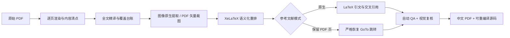

<div align="center">

# 📖 paper-translation

### 论文值得被认真翻译，也值得被认真排版。

**一个面向 AI Agent 的学术论文全文精译 Skill：忠实保留科学内容，以矢量为先处理图表，并生成优雅、可编辑、可点击引用的中文 LaTeX PDF。**

[](LICENSE)


[English](README.en-US.md) · [简体中文](README.md) · [Agent 使用说明](SKILL.md) · [参与贡献](CONTRIBUTING.md)


<sub>来自 CCC（NSDI 2026）论文中文译排的真实页面节选，仅供展示；[原文出处与版权说明](THIRD_PARTY_NOTICES.md)</sub>

</div>

---

## 不只是翻译文字

论文里的信息不只在段落里。**公式、符号、坐标轴、算法、实验数据、引用与限定语**，都是科学内容的一部分。

`paper-translation` 把一套可靠的学术论文精译方法变成 Agent 能执行的工作流：**全文翻译 + 原生 PDF 图像提取 + 矢量图保留 + LaTeX 重排 + 可点击参考文献 + 全流程质量检查**。

> **这不是一个“运行脚本就会自动翻译”的 API。** Python 脚本负责提取、构建和验证；真正的阅读、翻译、技术核对和排版修正由使用这个 Skill 的 AI Agent 完成。项目不包含模型 API Key，也不依赖某个特定的付费模型。

## 为什么值得用它？

| 能力 | 具体做法 |
|:--|:--|
| 🧭 **防止漏译** | 通过章节标题 + 矢量裁图几何信息自动生成覆盖率**候选映射**；必须逐节核对，不能假装自动完成翻译。 |
| 🧪 **技术语义优先** | 保留作者措辞的确定性程度、因果方向、数值、单位、百分位数、公式与实验结论。 |
| ✒️ **真正的译排** | 输出可搜索、可复制的中文正文与 LaTeX 数学公式，而不是整页截图。 |
| 🧬 **矢量图优先** | 照片提取原始图像对象；统计图与架构图按 PDF 矢量区域直接裁取，完整保留轴线、图例和标注。 |
| 🧩 **算法不乱改** | 默认原样保留 Algorithm 伪代码和源代码，正文另译解释。 |
| 🔗 **引用可跳转** | 原生 `\cite`/`\bibitem`，或保留参考文献原始 PDF 页并恢复 GoTo 跳转。 |
| 🪄 **耐读的排版风格** | 自带无个人信息的 XeLaTeX 模板：Latin Modern Roman、舒展行距、克制色彩与中西文字体搭配。 |
| ✅ **真的会失败的 QA** | 递归扫描多文件、引文/标签检查、原文覆盖率、编译日志、PDF 跳转与页面渲染验证。 |

### 看看真实的页面

<details>
<summary><b>展开大图</b>：复杂公式、未翻译算法、实验结果表格</summary>

| 公式 | 原文算法 | 实验表格 |
|:--:|:--:|:--:|
|  |  |  |

*README 使用的图片是渲染后的页面截图；正式译文内部能够保留矢量图的地方仍使用矢量 PDF，而不是这几张截图。*

</details>

## 工作流程



具体执行包括：

1. **逐页清点**：章节、跨栏段落、公式、图、表、算法、脚注、附录与文献，记录源页码。
2. **完整翻译**：先统一术语，再按段落精译；用 coverage ledger 预防漏段、漏句。
3. **无损处理图表**：只含位图时直接取嵌入对象，图表含矢量对象时直接从 PDF 以矢量裁取，不拿截图凑数。
4. **LaTeX 重排**：重建公式与编号，配好图注、表注、语义化 `\label`、`\ref`、`\eqref`；伪代码默认英文原样。
5. **参考文献恢复**：选择可靠的原生 TeX 方式，或导入原始文献页并修复跳转。
6. **反复验收**：编译 → 代码/引用/覆盖检查 → 逐页渲染 → 修复 → 再渲染。

完整的 Agent 操作说明在 [`SKILL.md`](SKILL.md)，细则在 [`references/`](references/)。

## 快速开始

### 环境要求

- Python **3.10+**，[`PyMuPDF`](https://pymupdf.readthedocs.io/) 与 [`Pillow`](https://pillow.readthedocs.io/)
- XeLaTeX、`latexmk` 和较完整的 TeX Live 环境（包括 `xeCJK`、`unicode-math`、`scrartcl`、`siunitx`、`pdfpages` 等）
- 中文衬线/无衬线字体，例如 Noto Serif/Sans CJK 或思源宋体/黑体；**仓库不打包字体文件**
- 一个能阅读 PDF、修改文件、执行命令的 Agent

### 创建工程

```bash
git clone https://github.com/Micraow/paper-translation-skill.git
cd paper-translation-skill
python3 -m pip install -r requirements.txt

python3 scripts/init_project.py ../my-paper
cp /path/to/original-paper.pdf ../my-paper/sources/original.pdf
cd ../my-paper
```

让 Agent 阅读仓库里的 `SKILL.md`，并给它一段这样的任务：

> 使用 paper-translation Skill 全文精译这篇论文，用自带的 XeLaTeX 模板输出中文 PDF。公式、编号、矢量图、数据表、文献与附录全部保留；算法伪代码不翻译；正文引用和图表公式交叉引用必须可点击。交付 PDF 与完整源码工程，并完成全文覆盖核验与逐页视觉检查。

### 先跑通模板

```bash
make             # 默认 native 参考文献模式，可直接编译演示
make render      # work/final-render/contact-sheet.png
```

### 大论文的覆盖率台账，不再逐行手填

```bash
cp assets/coverage-map.example.json assets/coverage-map.json
# 根据源 PDF 渲染页面修改全部章节正则、对应 .tex 文件和双栏分界坐标
make seed-coverage         # 每个源标题必须恰好匹配一次；自动建议路径，但状态全部为 todo
# 逐节对照原 PDF 与译文后，再确认已复核的章节：
python scripts/confirm_coverage.py work/coverage.tsv --status translated \
  --target sections/01-introduction.tex \
  --review-note '已逐段核对原文第 2-3 页、双栏交界和译文的完整对应关系'
```

具体用法见 [大规模覆盖台账指南](references/COVERAGE_LEDGER.md)。这是**辅助核对**，而不是自动宣称译文完整。模板还内置微秒单位安全宏 `\us`、独立算法编号、中文强调宏 `\zhstrong`，对无效 CJK 斜体与缺少字形进行门禁检查。

**注意**：初始模板的引言、公式及参考文献都是**明确标记的演示内容**，不会凭空翻译 `sources/original.pdf`。Agent 需要按原论文完整替换后，才算真正产出译文。

## 两种参考文献模式

<details open>
<summary><b>A · LaTeX 原生参考文献（推荐）</b></summary>

把原论文全部参考文献准确放进 `sections/references.tex`（或配置正确的 `.bib`），正文用 `\cite{key}`，章节/公式/图表用 `\label` 与 `\ref`/`\eqref`。

```bash
make
```

生成 PDF 时会产生内部跳转；多文件检查器会递归检查所有 `\input` 章节及引文键。

</details>

<details>
<summary><b>B · 保留原始参考文献矢量 PDF 页</b></summary>

在 `main.tex` 中设置原始文献页范围 `\OriginalReferencePages`；正文保留忠实的数字引文 `[n]`，然后执行：

```bash
make BIB_MODE=pdf
# 如果自动定位文献起始页不可靠，显式指定“译文最终 PDF”的页码：
make BIB_MODE=pdf REF_START_PAGE=35 REF_END_PAGE=38
```

处理器会建立可点击的 GoTo 注释；**缺少目标编号或缺少链接时直接失败**。不要和原生 `\cite` 混用。

</details>

## 质量门禁

```bash
make            # 编译 + 递归 LaTeX 检查 + 日志审计 + PDF 引用检查
make release    # 在上面基础上核对源文本覆盖台账，渲染全部页面
```

正式运行 `make release` 前，请先用 `make seed-coverage` 生成 `work/source-blocks.tsv` 与带**建议字段**的 `work/coverage.tsv`，再**逐段复核**并确认实际对应关系。任何漏项、未完成 TODO、失效链接、无效引文等都会阻止通过。

**自动检查不等于翻译准确。** Agent 还必须查看源文与译文的对应关系，核对多栏交界处的句子、复杂公式，逐一检查图表裁切是否完整，并打开最终 PDF 抽查链接跳转。

## 仓库结构

```text
paper-translation-skill/
├── SKILL.md                  # 供 Agent 阅读的核心规范
├── README.md                 # 中文项目主页
├── README.en-US.md           # English documentation
├── LICENSE                   # MIT
├── THIRD_PARTY_NOTICES.md    # 原论文/截图/字体/依赖版权说明
├── agents/openai.yaml
├── requirements.txt
├── scripts/                  # PDF 提取、矢量裁切、引用恢复、检查脚本
├── assets/latex-template/    # 无个人信息的 XeLaTeX 模板、Makefile
├── references/               # 翻译、交叉引用、图表和 QA 的深度说明
├── tests/                    # 合成 PDF 的单元与回归测试
└── docs/images/             # GitHub 展示图，不作为论文中的图
```

## 许可证与版权

项目的**原创脚本、说明及通用 LaTeX 模板**采用 [MIT License](LICENSE)。但这不意味着用户翻译的论文、原始图表、README 中含原论文片段的预览图、专有字体或第三方库都自动变成 MIT；详见 [`THIRD_PARTY_NOTICES.md`](THIRD_PARTY_NOTICES.md)。尤其在公开分发全文译文前，应确认原论文的版权与改编、分发许可。

欢迎提交 Bug、补充合规的最小复现用例、修正文献链接/图表裁切的边缘情况，以及优化 LaTeX 审美。贡献方式见 [`CONTRIBUTING.md`](CONTRIBUTING.md)。如果觉得有用，欢迎给仓库点一个 ⭐。

<div align="center">

**忠于论文，也让论文更好读。**

</div>
